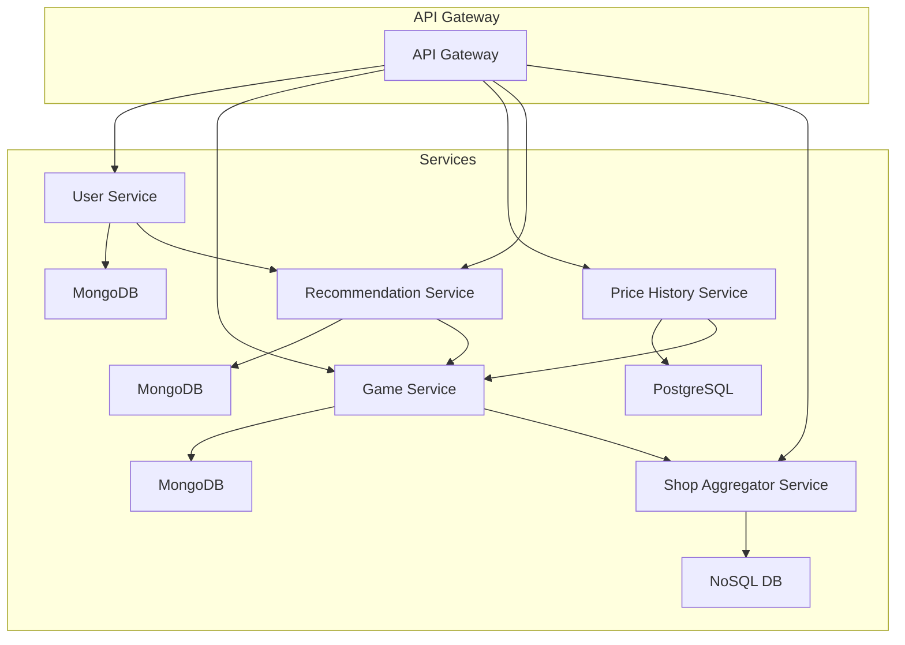

# Microservices Architectuur voor Meta-Gameshop

In dit gedeelte gaan ik de microservices-architectuur verder uitwerken. De focus ligt op de afhankelijkheden, communicatie, en implementatie van de microservices die de verschillende componenten van de meta-gameshop beheren.

---

## 🎯 Doel

De microservices architectuur biedt de mogelijkheid om verschillende delen van de applicatie onafhankelijk te schalen, te ontwikkelen en te onderhouden. Elke service is verantwoordelijk voor een specifiek domein (bijvoorbeeld gebruikersbeheer, gamebeheer, enzovoort).

---

## Microservices

| **Microservice**              | **Verantwoordelijkheid**                                                                | **Technologie**               | **Database**                |
|-------------------------------|------------------------------------------------------------------------------------------|-------------------------------|-----------------------------|
| **User Service**               | Beheer van gebruikersprofielen, voorkeuren en authenticatie.                            | Node.js + Express             | MongoDB                    |
| **Game Service**               | Beheer van game-informatie, zoals metadata, prijzen en beschrijvingen.                  | Python + Flask                | MongoDB                    |
| **Price History Service**      | Houdt de prijsgeschiedenis bij en stuurt meldingen bij prijswijzigingen.                | Go + Gin                     | PostgreSQL                 |
| **Recommendation Service**     | Genereert aanbevelingen op basis van gebruikersgedrag en voorkeuren.                    | Java + Spring Boot            | MongoDB                    |
| **Shop Aggregator Service**    | Haalt prijzen en beschikbaarheid op van verschillende externe winkels/platformen.      | Python + Flask                | NoSQL (bijv. MongoDB)       |

---

## Microservices Communicatie

In dit systeem worden de microservices via REST API's of gRPC met elkaar verbonden. De API Gateway zal als centraal toegangspunt dienen voor de communicatie met het systeem, terwijl de Kubernetes omgeving de orchestratie en schaling van de containers verzorgt.

---

## Mermaid Diagram - Microservices Architectuur

# 🚀 Implementatie in Kubernetes

De microservices worden geïmplementeerd in containers en beheerd via Kubernetes. De verschillende services draaien in aparte pods binnen de Kubernetes-cluster, en de communicatie tussen deze services gebeurt via interne API-aanroepen.

### Microservices Implementatie

1. **User Service**: 
   - De **User Service** draait in een container en biedt endpoints voor het beheren van gebruikersprofielen.
   - Deze service slaat gebruikersinformatie op in **MongoDB**.

2. **Game Service**: 
   - De **Game Service** biedt toegang tot game-informatie, inclusief metadata en prijsinformatie.
   - Dit wordt opgeslagen in **MongoDB** en de service is verantwoordelijk voor het ophalen van gegevens uit externe winkels.

3. **Price History Service**:
   - Deze service houdt de prijsgeschiedenis van games bij, zodat gebruikers meldingen kunnen ontvangen bij prijswijzigingen.
   - De prijsinformatie wordt opgeslagen in **PostgreSQL**.

4. **Recommendation Service**: 
   - Gebruikt gegevens uit de **User Service** en **Game Service** om aanbevelingen te genereren voor de gebruiker.
   - De aanbevolen games worden opgeslagen in **MongoDB**.

5. **Shop Aggregator Service**:
   - Deze service verbindt met externe winkels zoals **Steam**, **Epic**, en **PlayStation** om prijsinformatie en beschikbaarheid op te halen.
   - Het maakt gebruik van **NoSQL** om flexibele data-opslag te bieden.

---

## Kubernetes Orkestratie

In Kubernetes worden de microservices verdeeld over verschillende pods. Elke microservice draait in zijn eigen container, en Kubernetes zorgt voor de juiste toewijzing van resources, schaalbaarheid, en beschikbaarheid.

### Kubernetes Deployments

- Elke microservice wordt gepusht naar een **Docker container**.
- **Kubernetes Deployments** zorgen ervoor dat de juiste versies van de microservices draaien en kunnen schalen op basis van de belasting.

### Kubernetes Services

- **Kubernetes Services** zorgen ervoor dat microservices elkaar kunnen vinden en communiceren, zelfs wanneer ze in verschillende pods draaien.
