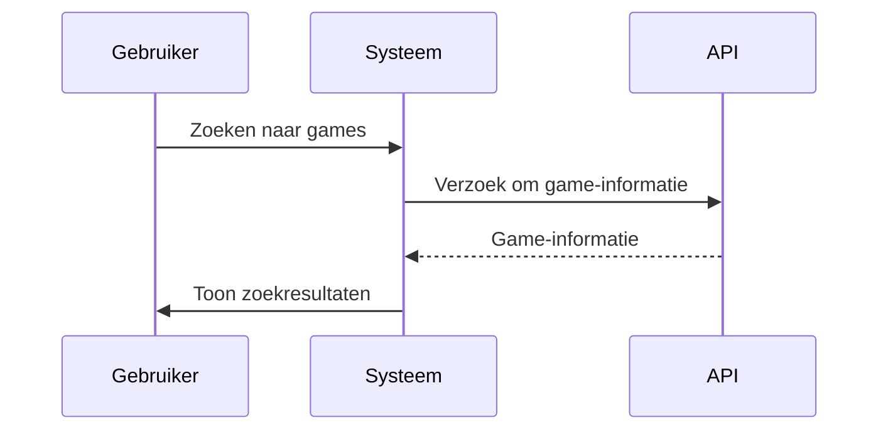
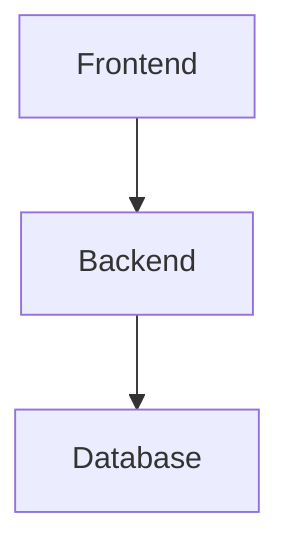
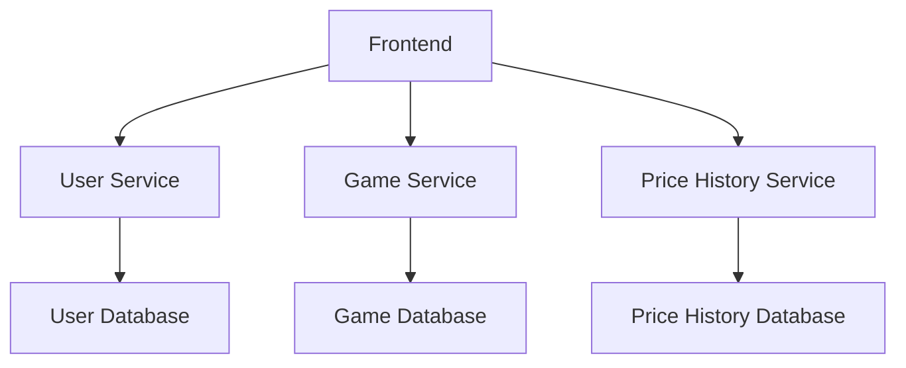
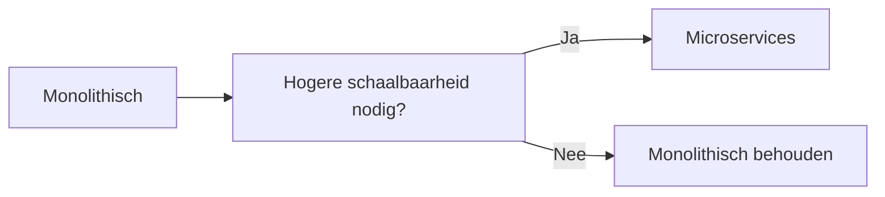
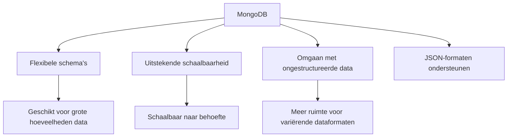

# ICT Architecture Project - Meta-Gameshop

## Inleiding
Een meta-winkel voor games die informatie bundelt uit meerdere platformen, prijsgeschiedenis toont, collecties beheert en aanbevelingen genereert.

---

## 1. Belangrijke Softwarekarakteristieken

Hier beschrijven we de relevante software qualities (karakteristieken) en waarom ze belangrijk zijn voor dit project.

### 1.1 Availability (Beschikbaarheid)
De applicatie moet continu beschikbaar zijn, ongeacht het tijdstip of de regio. Gebruikers willen games kunnen zoeken of collecties beheren op elk moment, en vooral tijdens kortingen of sales piekt het verkeer. Een hoge beschikbaarheid is cruciaal om gebruikers niet te verliezen en vertrouwen in het platform op te bouwen. We moeten daarom inzetten op redundantie, failovers en het vermijden van single points of failure.

### 1.2 Scalability (Schaalbaarheid)
De applicatie moet kunnen meegroeien met het aantal gebruikers en de hoeveelheid data (games, prijzen, stores). Denk aan grote verkoopmomenten of populaire releases die zorgen voor een plotse toename in verkeer. Schaalbaarheid is nodig voor zowel het frontend (bijv. veel bezoekers) als backend (bijv. data ophalen van externe API’s).

### 1.3 Modifiability (Aanpasbaarheid)
De game-industrie verandert snel. Nieuwe platformen, winkels en features moeten makkelijk kunnen worden toegevoegd zonder grote wijzigingen aan de bestaande codebase. De architectuur moet modulair en onderhoudsvriendelijk zijn zodat updates snel en veilig kunnen gebeuren.

### 1.4 Resilience (Veerkracht)
Sommige externe bronnen (zoals winkel-API’s) kunnen onbetrouwbaar of tijdelijk onbeschikbaar zijn. Het systeem moet hiermee kunnen omgaan zonder dat gebruikers daar veel hinder van ondervinden. Fouttolerantie, caching en fallback-mechanismen zijn dus noodzakelijk.

### 1.5 Performance (Prestaties)
Gebruikers willen snel resultaten zien bij het zoeken, filteren of bladeren door games. Ook het laden van de prijsgeschiedenis, ratings en aanbevelingen moet snel gebeuren. Hoge prestaties zorgen voor een goede gebruikerservaring en minder afhakers.

### 1.6 Security (Beveiliging)
Aangezien gebruikers persoonlijke voorkeuren, collecties en mogelijk accounts van winkels koppelen, is beveiliging essentieel. Authenticatie, toegangsbeheer en veilige opslag van gegevens moeten correct geïmplementeerd worden om misbruik of datalekken te voorkomen.

---

### Driving characteristics

De belangrijkste drijfveren voor dit project zijn:

- **Availability**: zonder constante beschikbaarheid verliezen we snel gebruikers.
- **Modifiability**: het systeem moet zich kunnen aanpassen aan een veranderende markt.
- **Scalability**: om pieken in gebruik te kunnen opvangen en in de toekomst te groeien.
- **Resilience**: externe afhankelijkheden mogen de app niet breken.

Deze karakteristieken zullen de grootste invloed hebben op onze architecturale keuzes.

## 2. Logische Componenten

In dit gedeelte beschrijven we de logische componenten van het systeem. Dit omvat de verschillende actoren en de acties die ze ondernemen binnen het systeem, evenals de onderliggende processen en workflows.

### 2.1 Actoren

De belangrijkste actoren in dit systeem zijn:

1. **Eindgebruikers**:
   - **Acties**: Zoeken naar games, beheren van hun collectie, geven van ratings, ontvangen van prijsmeldingen, beheren van voorkeuren (platforms en winkels).
   - **Doelen**: Het efficiënt vinden van games, het beheren van hun gamecollectie, het krijgen van aanbevelingen op basis van hun voorkeuren.

2. **Curatoren**:
   - **Acties**: Goedkeuren van ingezonden media (screenshots, trailers), handmatig toevoegen van games of aanpassen van game-informatie om dubbelingen of slechte kwaliteit te voorkomen.
   - **Doelen**: Zorgen voor een nette, accurate en kwalitatieve database van games.

3. **Externe API’s/Winkels**:
   - **Acties**: Aanleveren van game-informatie, prijsgeschiedenis en store-data.
   - **Doelen**: Verstrekken van up-to-date en correcte gegevens over hun platformen en producten.

4. **Uitgevers**:
   - **Acties**: Levering van promotiemateriaal zoals screenshots, trailers en andere marketing-informatie.
   - **Doelen**: Zorgen voor de correcte presentatie van hun games op het platform.

5. **Diagram**:

  ```mermaid
    graph TD;
    A[Eindgebruikers] --> B[Zoeken naar games]
    A --> C[Beheren van collectie]
    A --> D[Ontvangen van prijsmeldingen]
    A --> E[Beheren van voorkeuren]
    F[Curatoren] --> G[Goedkeuren van media]
    F --> H[Handmatig toevoegen van games]
    I[Externe API's/Winkels] --> J[Aanleveren van game-informatie]
    K[Uitgevers] --> L[Levering van promotiemateriaal]
```
---

### 2.2 Acties en Workflows

De belangrijkste workflows in het systeem zijn:

- **Zoeken en Bladeren**:
  - Gebruikers zoeken naar games op basis van genre, platform, prijs en andere filters.
  - Aanbevelingen worden gegenereerd op basis van de gebruikerscollectie en voorkeuren.
  - Gebruikers kunnen game-pagina’s bekijken met details zoals screenshots, trailers, en rating.

- **Collectiebeheer**:
  - Gebruikers kunnen handmatig games toevoegen aan hun collectie.
  - Er is ook de mogelijkheid om informatie automatisch in te laden van winkels zoals Steam, PlayStation Store, etc.
  - Gebruikers kunnen hun collectie organiseren en beheren.

- **Prijsmeldingen en Geschiedenis**:
  - Gebruikers kunnen een melding ontvangen wanneer de prijs van een game daalt of een speciale aanbieding beschikbaar is.
  - Het systeem toont een gedetailleerde prijsgeschiedenis per game over meerdere winkels.

- **Curatie en Moderatie**:
  - Curatoren controleren en valideren media-inhoud die door gebruikers wordt ingediend.
  - Dubbele entries of onjuiste data worden verwijderd of aangepast.

- **Beveiliging en Authenticatie**:
  - Gebruikers kunnen hun account beveiligen met bijvoorbeeld tweefactorauthenticatie.
  - Toegang tot persoonlijke gegevens (collecties, voorkeuren) is beveiligd.

- **Diagram**:


---

## 3. Architecturale Stijlen

In dit project zullen we zowel een **monolithische** als een **microservices-architectuur** overwegen en een keuze maken op basis van de vereisten en karakteristieken van het systeem.

### 3.1 Monolithische Architectuur
In een monolithische architectuur is het systeem opgebouwd als één enkele, geïntegreerde applicatie. Dit betekent dat alle componenten en functionaliteiten binnen dezelfde codebase zitten en samenwerken.

**Voordelen**:
- Eenvoudige implementatie en beheer voor kleinere systemen.
- Minder overhead in communicatie tussen componenten.
- Gemakkelijkere testing en debugging.

**Nadelen**:
- Moeilijker schaalbaar naarmate het aantal gebruikers toeneemt.
- Langzamere ontwikkelingstijd door de grootte van de codebase.
- Risico van performanceproblemen bij pieken in verkeer.

**Diagram**:


### 3.2 Microservices Architectuur
In een microservices-architectuur wordt het systeem opgesplitst in kleinere, onafhankelijke services die communiceren via API’s.

**Voordelen**:
- Betere schaalbaarheid door het onafhankelijk schalen van services.
- Flexibiliteit in technologieën (verschillende microservices kunnen in verschillende talen worden geschreven).
- Makkelijker onderhoud en updates, doordat alleen een specifieke service hoeft te worden aangepast.

**Nadelen**:
- Complexere implementatie en beheer.
- Meer netwerkverkeer en complexiteit door de communicatie tussen services.
- Hogere operationele kosten door het beheren van meerdere services.

**Diagram**:


---

## 4. Architecturale Beslissingen (ADR's)

## ADR 1: Keuze voor Microservices Architectuur

### Context
Het systeem zal verschillende, van elkaar onafhankelijke functionaliteiten moeten ondersteunen, zoals gebruikersbeheer, game-informatie, prijsgeschiedenis en aanbevelingen. Elk van deze functionaliteiten kan onafhankelijk schalen, en ze zullen communiceren met externe API’s, wat een flexibele en modulaire architectuur vereist.

### Keuze
Microservices-architectuur.

### Alternatieven
Een monolithische benadering werd overwogen, waarbij alle componenten binnen één applicatie zouden draaien. Dit zou eenvoudiger zijn om te implementeren, maar biedt niet de schaalbaarheid en flexibiliteit die nodig is voor pieken in verkeer en veranderingen in de externe API’s.

### Reden voor keuze
Microservices bieden de mogelijkheid om specifieke functionaliteiten onafhankelijk van elkaar te schalen. Dit is vooral belangrijk voor het toekomstige verkeer en de veranderende marktomstandigheden. Elke service kan worden geüpdatet zonder de andere te verstoren, en het systeem blijft flexibel en onderhoudsvriendelijk.

### Gevolgen
Het gebruik van microservices betekent dat we verschillende technologieën kunnen gebruiken voor verschillende services, zoals Node.js voor gebruikersbeheer en Python voor prijsgeschiedenis. Dit kan de leercurve verhogen, maar biedt tegelijkertijd meer schaalvoordelen.

### Beslissing


---

## ADR 2: Keuze voor Kubernetes voor Orkestratie

### Context
Het systeem zal uit meerdere microservices bestaan die op verschillende containers moeten draaien. De complexiteit van het beheren van deze containers en de mogelijkheid om automatisch te schalen, vereist een orkestratie-oplossing.

### Keuze
Kubernetes voor orkestratie.

### Alternatieven
Docker Swarm werd als alternatief overwogen, maar Kubernetes biedt meer geavanceerde functionaliteit zoals automatische schaling, uitgebreide monitoring en een groter ecosysteem van tools. Andere orkestratietools zoals Apache Mesos zijn ook beschikbaar, maar Kubernetes heeft een groter gebruikersnetwerk en een breed scala aan integraties.

### Reden voor keuze
Kubernetes is de standaard voor containerorkestratie en biedt uitgebreide ondersteuning voor het schalen van microservices, evenals tools voor monitoring, logging en fouttolerantie. Het stelt ons in staat om services automatisch te schalen op basis van de belasting, wat essentieel is voor de beschikbaarheid en veerkracht van het systeem.

### Gevolgen
Het gebruik van Kubernetes vereist dat we vertrouwd raken met de Kubernetes-configuratie en de tools die daarbij horen. We moeten mogelijk extra middelen inzetten voor de ontwikkeling en beheer van de Kubernetes-cluster, maar de voordelen van schaalbaarheid en fouttolerantie wegen op tegen deze kosten.


---

# ADR 3: Keuze voor MongoDB als Database

## Context
Het systeem vereist een database die goed om kan gaan met ongestructureerde data, zoals game-informatie, prijsgeschiedenis, en gebruikersbeoordelingen. Daarnaast moeten we kunnen schalen afhankelijk van het verkeer en de hoeveelheid data.

## Keuze
MongoDB als database.

## Alternatieven
Relationale databases zoals PostgreSQL en MySQL werden overwogen, maar deze bieden niet dezelfde flexibiliteit voor het omgaan met ongestructureerde data en het schalen van grote hoeveelheden data zoals MongoDB dat doet.

## Reden voor keuze
MongoDB is een document-georiënteerde database die goed omgaat met ongestructureerde data. Het biedt flexibele schema's en uitstekende schaalbaarheid voor grote hoeveelheden data, wat essentieel is voor de groei van het systeem. Daarnaast ondersteunt het native JSON-formaten, wat goed past bij de aard van de gegevens die we willen opslaan.

## Gevolgen
Het gebruik van MongoDB betekent dat we moeten zorgen voor een schema-ontwerp dat goed omgaat met document-georiënteerde gegevens. We moeten mogelijk ook extra tools gebruiken voor databasebeheer en performance-optimalisatie.


---