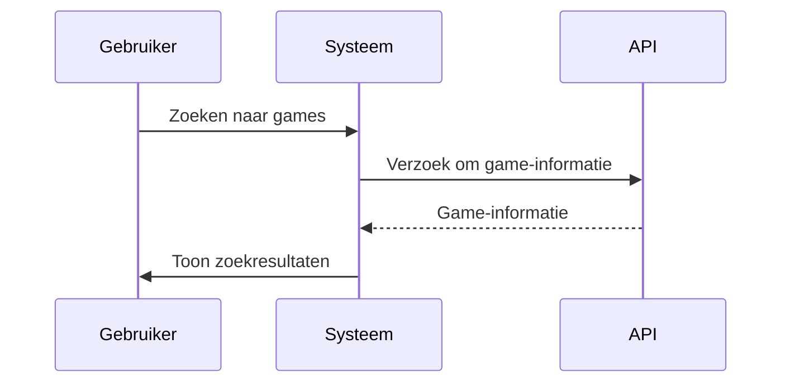

# ICT Architecture Project - Meta-Gameshop

## Inleiding
Een meta-winkel voor games die informatie bundelt uit meerdere platformen, prijsgeschiedenis toont, collecties beheert en aanbevelingen genereert.

---

## 1. Belangrijke Softwarekarakteristieken

Hier beschrijven we de relevante software qualities (karakteristieken) en waarom ze belangrijk zijn voor dit project.

### 1.1 Availability (Beschikbaarheid)
De applicatie moet continu beschikbaar zijn, ongeacht het tijdstip of de regio. Gebruikers willen games kunnen zoeken of collecties beheren op elk moment, en vooral tijdens kortingen of sales piekt het verkeer. Een hoge beschikbaarheid is cruciaal om gebruikers niet te verliezen en vertrouwen in het platform op te bouwen. We moeten daarom inzetten op redundantie, failovers en het vermijden van single points of failure.

### 1.2 Scalability (Schaalbaarheid)
De applicatie moet kunnen meegroeien met het aantal gebruikers en de hoeveelheid data (games, prijzen, stores). Denk aan grote verkoopmomenten of populaire releases die zorgen voor een plotse toename in verkeer. Schaalbaarheid is nodig voor zowel het frontend (bijv. veel bezoekers) als backend (bijv. data ophalen van externe API’s).

### 1.3 Modifiability (Aanpasbaarheid)
De game-industrie verandert snel. Nieuwe platformen, winkels en features moeten makkelijk kunnen worden toegevoegd zonder grote wijzigingen aan de bestaande codebase. De architectuur moet modulair en onderhoudsvriendelijk zijn zodat updates snel en veilig kunnen gebeuren.

### 1.4 Resilience (Veerkracht)
Sommige externe bronnen (zoals winkel-API’s) kunnen onbetrouwbaar of tijdelijk onbeschikbaar zijn. Het systeem moet hiermee kunnen omgaan zonder dat gebruikers daar veel hinder van ondervinden. Fouttolerantie, caching en fallback-mechanismen zijn dus noodzakelijk.

### 1.5 Performance (Prestaties)
Gebruikers willen snel resultaten zien bij het zoeken, filteren of bladeren door games. Ook het laden van de prijsgeschiedenis, ratings en aanbevelingen moet snel gebeuren. Hoge prestaties zorgen voor een goede gebruikerservaring en minder afhakers.

### 1.6 Security (Beveiliging)
Aangezien gebruikers persoonlijke voorkeuren, collecties en mogelijk accounts van winkels koppelen, is beveiliging essentieel. Authenticatie, toegangsbeheer en veilige opslag van gegevens moeten correct geïmplementeerd worden om misbruik of datalekken te voorkomen.

---

### Driving characteristics

De belangrijkste drijfveren voor dit project zijn:

- **Availability**: zonder constante beschikbaarheid verliezen we snel gebruikers.
- **Modifiability**: het systeem moet zich kunnen aanpassen aan een veranderende markt.
- **Scalability**: om pieken in gebruik te kunnen opvangen en in de toekomst te groeien.
- **Resilience**: externe afhankelijkheden mogen de app niet breken.

Deze karakteristieken zullen de grootste invloed hebben op onze architecturale keuzes.

## 2. Logische Componenten

In dit gedeelte beschrijven we de logische componenten van het systeem. Dit omvat de verschillende actoren en de acties die ze ondernemen binnen het systeem, evenals de onderliggende processen en workflows.

### 2.1 Actoren

De belangrijkste actoren in dit systeem zijn:

1. **Eindgebruikers**:
   - **Acties**: Zoeken naar games, beheren van hun collectie, geven van ratings, ontvangen van prijsmeldingen, beheren van voorkeuren (platforms en winkels).
   - **Doelen**: Het efficiënt vinden van games, het beheren van hun gamecollectie, het krijgen van aanbevelingen op basis van hun voorkeuren.

2. **Curatoren**:
   - **Acties**: Goedkeuren van ingezonden media (screenshots, trailers), handmatig toevoegen van games of aanpassen van game-informatie om dubbelingen of slechte kwaliteit te voorkomen.
   - **Doelen**: Zorgen voor een nette, accurate en kwalitatieve database van games.

3. **Externe API’s/Winkels**:
   - **Acties**: Aanleveren van game-informatie, prijsgeschiedenis en store-data.
   - **Doelen**: Verstrekken van up-to-date en correcte gegevens over hun platformen en producten.

4. **Uitgevers**:
   - **Acties**: Levering van promotiemateriaal zoals screenshots, trailers en andere marketing-informatie.
   - **Doelen**: Zorgen voor de correcte presentatie van hun games op het platform.

5. **Diagram**:

  ```mermaid
    graph TD;
    A[Eindgebruikers] --> B[Zoeken naar games]
    A --> C[Beheren van collectie]
    A --> D[Ontvangen van prijsmeldingen]
    A --> E[Beheren van voorkeuren]
    F[Curatoren] --> G[Goedkeuren van media]
    F --> H[Handmatig toevoegen van games]
    I[Externe API's/Winkels] --> J[Aanleveren van game-informatie]
    K[Uitgevers] --> L[Levering van promotiemateriaal]
```
---

### 2.2 Acties en Workflows

De belangrijkste workflows in het systeem zijn:

- **Zoeken en Bladeren**:
  - Gebruikers zoeken naar games op basis van genre, platform, prijs en andere filters.
  - Aanbevelingen worden gegenereerd op basis van de gebruikerscollectie en voorkeuren.
  - Gebruikers kunnen game-pagina’s bekijken met details zoals screenshots, trailers, en rating.

- **Collectiebeheer**:
  - Gebruikers kunnen handmatig games toevoegen aan hun collectie.
  - Er is ook de mogelijkheid om informatie automatisch in te laden van winkels zoals Steam, PlayStation Store, etc.
  - Gebruikers kunnen hun collectie organiseren en beheren.

- **Prijsmeldingen en Geschiedenis**:
  - Gebruikers kunnen een melding ontvangen wanneer de prijs van een game daalt of een speciale aanbieding beschikbaar is.
  - Het systeem toont een gedetailleerde prijsgeschiedenis per game over meerdere winkels.

- **Curatie en Moderatie**:
  - Curatoren controleren en valideren media-inhoud die door gebruikers wordt ingediend.
  - Dubbele entries of onjuiste data worden verwijderd of aangepast.

- **Beveiliging en Authenticatie**:
  - Gebruikers kunnen hun account beveiligen met bijvoorbeeld tweefactorauthenticatie.
  - Toegang tot persoonlijke gegevens (collecties, voorkeuren) is beveiligd.

- **Diagram**:
